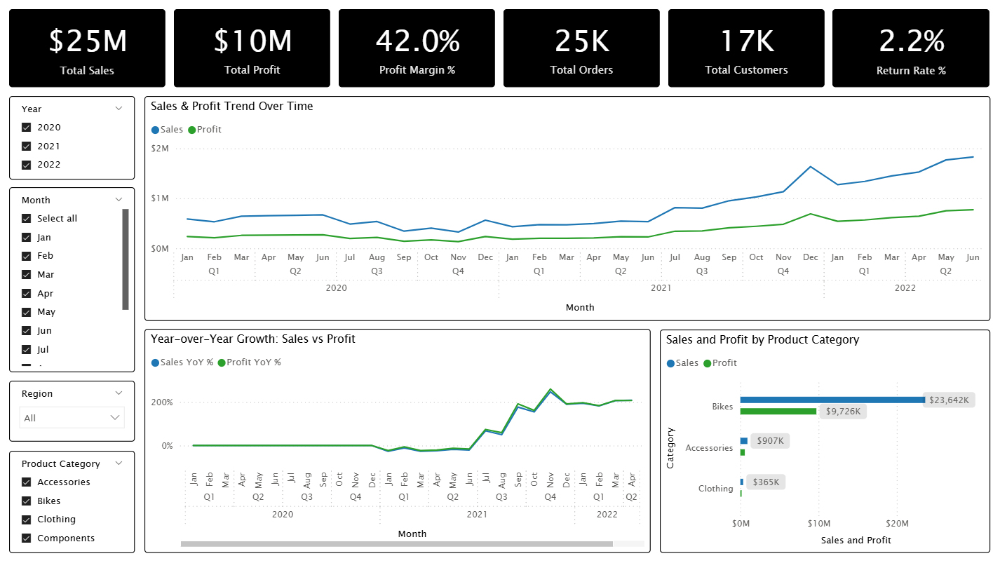
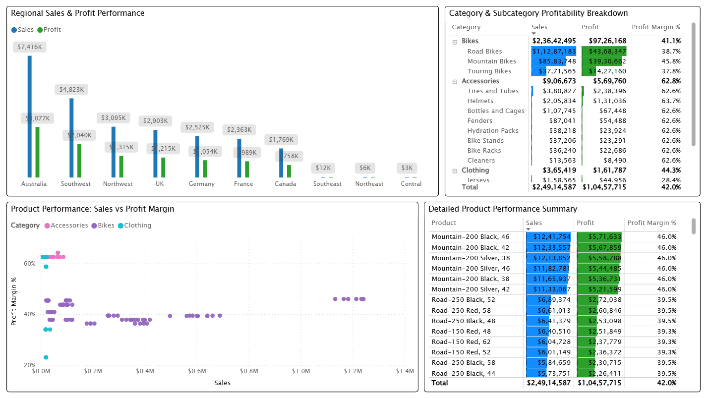
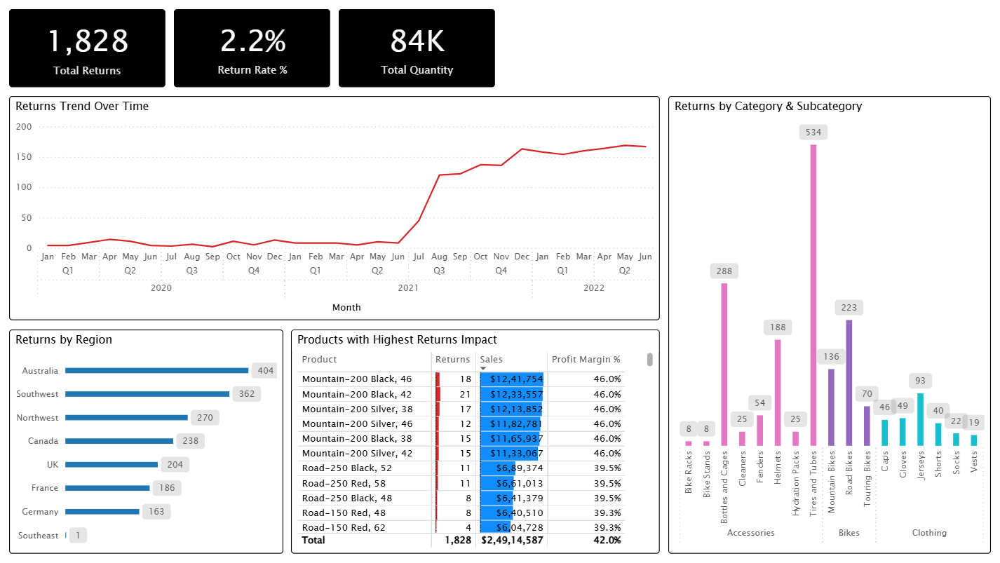

# AdventureWorks Sales & Profit Analysis  
(Power BI • DAX • Data Modeling)

## 📌 Project Overview
This project delivers an end-to-end sales and profitability analytics solution using the Microsoft AdventureWorks dataset and Power BI.

The dashboard helps business leadership answer key questions such as:

- How are sales and profits trending over time?
- Which regions and products generate the most revenue?
- Where are margins strongest and weakest?
- How many customers and orders drive business performance?
- What is the operational impact of product returns?

The project follows a professional analytics workflow:

Raw Data → Power Query (ETL) → Star Schema Modeling → DAX Measures → Interactive Power BI Dashboard

---

## 🛠 Tech Stack
- **Tool:** Microsoft Power BI  
- **Data Transformation:** Power Query (M)  
- **Data Modeling & Measures:** DAX  
- **Visualization:** Power BI Dashboards  
- **Data Source:** AdventureWorks sample dataset (CSV files)

---

## 📂 Data Architecture & Design

### Dataset Components
**Dimension Tables**
- dim_date  
- dim_product  
- dim_customer  
- dim_territory  

**Fact Tables**
- fact_sales  
- fact_returns  

### Modeling Approach
- Clean star schema design  
- Separate fact tables for sales and returns  
- No many-to-many relationships  
- All business logic implemented using DAX  
- Dedicated date dimension for time intelligence  

---

## 🔧 Power Query (ETL) Highlights

- Imported raw CSV files without modifying original data  
- Merged product, category, and subcategory into a unified dim_product table  
- Combined 2020–2022 sales files into a single sales fact table  
- Standardized data types and removed unnecessary columns  
- Built reusable transformations using Power Query M  

---

## 📐 Key DAX Measures

Key metrics implemented:

- Total Sales  
- Total Cost  
- Total Profit  
- Profit Margin %  
- Total Orders  
- Total Customers  
- Sales YoY %  
- Profit YoY %  
- Total Returns  
- Return Rate %  
- Avg Order Value  
- Revenue Per Customer  
- Margin Erosion Alert  
- Product & Territory Rankings  

---

## 📊 Dashboard Overview

### Page 1 – Executive Overview
- KPIs and trends  
- Sales & profit over time  
- Year-over-Year growth  
- Category performance  

---

### Page 2 – Sales & Profit Analysis
- Regional comparison  
- Product profitability scatter  
- Category & subcategory analysis  
- Detailed product table  

---

### Page 3 – Returns Impact Analysis
- Returns trends  
- Returns by region and category  
- Products with highest returns  

---

## 💡 Key Insights

### Business Performance Summary
- **Total Sales:** $24.91M  
- **Total Profit:** $10.46M  
- **Profit Margin:** 42%  
- **Total Orders:** 25,164  
- **Total Customers:** 17,416  
- **Return Rate:** 2.2%  

### Growth Trends
- Consistent growth from 2020 to 2022  
- Strong acceleration from mid-2021  
- Seasonal peaks in Q2 and Q4  

### Regional Insights
- Australia is the highest-performing region  
- Southwest and Northwest are major contributors  
- Some regions contribute very little revenue  

### Product Insights
- Bikes drive most revenue  
- Accessories deliver highest margins  
- Mountain-200 series is the top revenue generator  

### Returns Insights
- Returns remain very low overall  
- Increase in returns aligns with sales growth  
- No critical product or region-level return risks  

---

## 🔍 Business Conclusion
The analysis shows a healthy, profitable, and growing business with well-controlled returns and strong regional performance. Opportunities exist to expand accessory sales and diversify regional revenue.

---

## 🧠 Skills Demonstrated
- Star schema modeling  
- Power Query ETL  
- Advanced DAX  
- Time intelligence  
- Business analytics  
- Dashboard storytelling  

---

## 🚀 Future Enhancements
- Customer segmentation  
- Predictive forecasting  
- Advanced return analysis  
- SQL warehouse migration  

---

## 👤 Author
**Indranil Bhosale**  
Aspiring Data Analyst  
Power BI • SQL • Excel • Analytics
